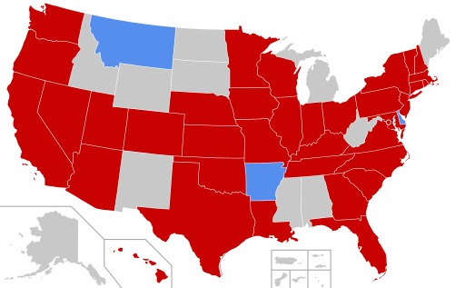

# COVID-19-SMS-Notifier

Credit: Pharexia / CC BY-SA

Demonstration of rapid development using python by a total novice.  This application scrapes NC Department of Public Health COVID-19 data.  Every 6 hours AWS cloudwatch triggers an AWS lambda function that sends the update as SMS via Twilio.

**Building Blocks:**

1. [Twilio](https://www.twilio.com) account with SMS number (alternative AWS SMS)
1. [AWS account](https://aws.amazon.com)
1. [Python](https://www.python.org) (3.7)

**Data Source:**

First, be responsible!  Don't hammer the [NC Department of Public Health Website](https://www.ncdhhs.gov/covid-19-case-count-nc).  I am only querying *every 6 hours*.  If they had an api, it would be a little easier.  [CDC](https://www.cdc.gov/coronavirus/2019-ncov/cases-in-us.html) currently (3/29/2020) doesn't have an api either.  Not sure why.

**Set-up**

The lambda function is pretty straight forward.  It is just a .py file.  The tricky part (for me) was the dependencies.  AWS lambda has layers (up to 5).  You create a requirement.txt file and pip install to grab all the dependencies. You then zip up the dependencies and load them into a lambda layer.  The file structure for the zip file matters.  Also, the permissions for the zip file matters.  

The program starts as a lambda function and scrapes the NC website using beautifulsoup.  A little parsing is done and it is good to go.  Since we are running off a lightweight lambda function, you can't lookup/store historical data (of course, you could write to a dynamoDB or S3 and query it...I just didn't have time).

The data is then sent out as SMS using Twilio SMS api.  You will need your own credientials.

Using a cloudwatch event, the lambda is called *every 6 hours*.  I don't currently know how quickly NC will update the data.  Also, the website layout was changed overnight and required me to quickly tweak the scraping (NC -- please don't change the layout OR provide an API -- please).

**Comments**

* This could easily be expanded to other counties, states, or countries.  
* This could easily be developed into an aggregator of multiple data sources.  
* Since the data is not changing that quickly, please don't query the NC website excessively.
* The lambda function is not expensive.  However, the current set-up uses twilio sms.  This can add-up and certainly other services or APIs can be built to lower the cost.

**Worth Mentioning**

* [NovelCOVID](https://github.com/NovelCOVID/API) is a Javascript/Typescript API sourcing from [Johns Hopkins CSSE](https://systems.jhu.edu/). Updates every 24 hours.
* [Hokins COVID-19](https://github.com/CSSEGISandData/COVID-19) is a visualization tool/dashboard from the Johns Hopkins University Center for System Science and Enginnering (JHU CSSE) sourcing data from many locations including the CDC.
* [Interactive county level map](https://mwaugh0328.github.io/covid-19-map/us_covid_map.html) by Michael Waugh.
* [Neherlab COVID-19 Modeling](https://neherlab.org/covid19/) -- models of infection based on mitigation efforts.  

**Thank You**

* [Center for Health Care Innovation](https://school.wakehealth.edu/Research/Institutes-and-Centers/Center-for-Healthcare-Innovation) at [Wake Forest Baptist Health](https://www.wakehealth.edu)
* Michael Kennedy of [Talk Python](https://training.talkpython.fm/)
